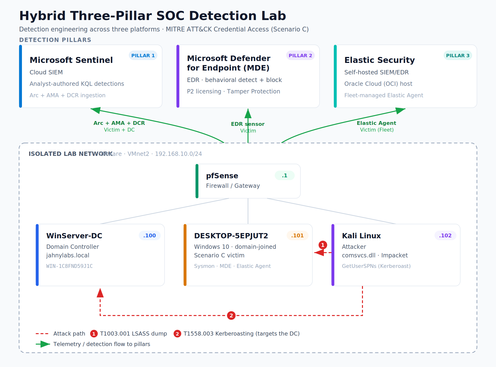

# jahnylabs — Hybrid Three-Pillar SOC Detection Lab

> A self-built, end-to-end Security Operations Center lab pairing a live Active Directory network with **three independent detection platforms** — Elastic Security, Microsoft Defender for Endpoint (EDR), and Microsoft Sentinel — to run real attacks and compare detection coverage across vendors.

**Built and documented by Jahny Robles** · Detection Engineering · SIEM · EDR · Threat Detection

---

## TL;DR

I built a complete attack-and-defend lab from scratch: an isolated Active Directory domain on a pfSense-segmented network, an attacker workstation, and **three detection stacks running simultaneously** against the same endpoints. I run adversary techniques from Kali, then hunt and detect them across all three platforms — comparing what each catches, what each misses, and why.

This isn't a follow-along tutorial environment. I architected the network, stood up the cloud SIEMs, onboarded the EDR, and worked through real production-style failures (agent connectivity, data-pipeline breaks, cross-tenant constraints) to get it stable.

**Flagship exercise — Scenario C (Credential Access) — is complete and validated end-to-end.** Additional scenarios are being added on a rolling basis (see [Status](#status)).

---

## The Three-Pillar Architecture

The core idea: monitor one set of endpoints from three different detection philosophies at once, then compare them head-to-head.

| Pillar | Platform | Detection philosophy | Hosting |
|---|---|---|---|
| **1 — SIEM (self-hosted)** | Elastic Security | Log + endpoint telemetry via Elastic Agent | Oracle Cloud (self-managed) |
| **2 — EDR** | Microsoft Defender for Endpoint P2 | Behavioral endpoint detection, auto incident correlation | Microsoft 365 tenant |
| **3 — SIEM (cloud)** | Microsoft Sentinel | KQL hunting over Windows Security events | Azure (via Arc + AMA + DCR) |



<details>
<summary>Text view of the topology</summary>

```
                       ┌─────────────────────────────────────────────┐
                       │        DETECTION PLANE (3 pillars)           │
                       │                                              │
                       │   Elastic SIEM    MDE P2 (EDR)   Sentinel    │
                       │   (Oracle Cloud)  (M365 tenant)  (Azure)     │
                       └───────▲──────────────▲──────────────▲────────┘
                               │              │              │
                          telemetry      EDR sensor    Security events
                               │              │         (Arc+AMA+DCR)
        ┌──────────────────────┴──────────────┴──────────────┴─────────┐
        │  ISOLATED LAB NETWORK  (VMware, VMnet2, 192.168.10.0/24)      │
        │                                                              │
        │   pfSense GW ── Win Server 2022 DC ── Win10 victim ── Kali    │
        │   (firewall)    (Active Directory)    (monitored)   (attacker)│
        └──────────────────────────────────────────────────────────────┘
```
</details>

> **Why three?** Real SOCs are multi-tool. Knowing that signature-based AV, behavioral EDR, and log-based SIEM each see a different slice of an attack — and being able to articulate the gaps between them — is exactly the analytical skill Tier 1/2 work demands. This lab is built to demonstrate that comparison directly.

New to any of the terms below? See the [**Glossary**](GLOSSARY.md).

---

## Hands-On Detection Engineering

Each attack is run from the Kali attacker box, then detected and documented across all three pillars. Detections are mapped to **MITRE ATT&CK** and built into a repeatable loop:

**Attack → Detect (×3 platforms) → Extract artifact → Write detection rule → Re-test → Document**

### Scenario roadmap

Scenario C is complete; the rest are the planned build-out this repo grows through.

| # | Scenario | Example techniques | MITRE | Status |
|---|---|---|---|---|
| A | Reconnaissance | Port scan, RDP brute force, SMB enum | T1595, T1110 | Planned |
| B | Execution & Persistence | Encoded PowerShell, scheduled tasks, run keys | T1059, T1053, T1547 | Planned |
| **C** | **Credential Access** | **LSASS dump, Kerberoasting** | **T1003.001, T1558.003** | ✅ **Complete + validated** |
| D | Lateral Movement | Pass-the-Hash, DCSync, Golden Ticket | T1550, T1003.006, T1558.001 | Planned |
| E | Exfiltration | DNS tunneling, data staging | T1048, T1560 | Planned |

### Detection-engineering highlight: AV vs. EDR vs. SIEM (Scenario C)

A two-part credential-access exercise showing how three classes of control see the same attacker differently. Neither technique drops a malicious file, so signature-based AV is blind to both — the real comparison is EDR vs. SIEM.

**Part 1 — LSASS memory dump (T1003.001).** Dumped `lsass` via the built-in `comsvcs.dll` MiniDump export — a living-off-the-land technique, nothing on disk. **Microsoft Defender for Endpoint blocked it behaviorally** and raised an incident with the full process tree; a follow-on attempt to disable Defender as admin was stopped by **Tamper Protection**. This is where EDR is strong — the attack lives on the endpoint, and the endpoint layer prevented it.

**Part 2 — Kerberoasting (T1558.003).** Requested an RC4 service ticket for a roastable service account from Kali. The attack succeeded and the DC logged event 4769 — **but Sentinel saw nothing.** The Domain Controller had never been onboarded to the SIEM, so the telemetry never arrived. I diagnosed the gap, onboarded the DC (Azure Arc + AMA + DCR), and **authored a KQL analytics rule detecting the RC4 request, validated end-to-end against live attack telemetry.** This is where EDR goes quiet — no endpoint behavior to catch — and the SIEM earns its place, but only once the right log source is flowing.

**The takeaway:** signature AV is blind to both; EDR owns the on-endpoint attack and misses the DC-side one; the SIEM is the inverse. Defense-in-depth isn't redundancy — each layer covers a different attack surface. And a detection is only as good as the telemetry feeding it: the coverage gap *was* the work, not the KQL.

→ Full writeup, results tables, and the detection rule: [`scenarios/scenario-c.md`](scenarios/scenario-c.md)
→ The validated rule itself: [`detections/sentinel-kql/scenario-c-kerberoast.kql`](detections/sentinel-kql/scenario-c-kerberoast.kql)

---

## What I Built (skills demonstrated)

**Infrastructure & networking**
- Designed and segmented an isolated lab network with a pfSense firewall/gateway
- Stood up a Windows Server 2022 **Active Directory** domain (DNS, NTP authority, domain-joined endpoints)
- Deployed a Kali attacker workstation with static addressing and network troubleshooting

**Cloud & SIEM**
- Self-hosted **Elastic Security** (Elasticsearch, Kibana, Fleet) on Oracle Cloud — full stack, not a managed tier
- Stood up **Microsoft Sentinel** with Azure Arc hybrid onboarding, Azure Monitor Agent, and Data Collection Rules
- Onboarded **Microsoft Defender for Endpoint P2** in a separate M365 tenant; verified sensor health, advanced hunting, and incident correlation

**Detection & analysis**
- Authored and **validated a KQL analytics rule** in Sentinel against live attack telemetry (Kerberoasting, 4769 RC4)
- Diagnosed and closed a **detection coverage gap** (DC telemetry never reaching the SIEM)
- Confirmed **MDE behavioral prevention** and Tamper Protection on an LSASS credential-dump attempt
- Mapped detections to **MITRE ATT&CK** and produced a cross-pillar detection comparison ([Scenario C writeup](scenarios/scenario-c.md))

**Operational maturity**
- Worked through real failures: agent IPv6 connectivity, a silently-dropped data-collection-rule association, cross-tenant integration constraints
- Authored a troubleshooting **runbook** with a decision tree so issues are reproducibly fixable ([AMA/Arc recovery](runbooks/ama-arc-snapshot-revert-recovery.md))
- Implemented a cold-snapshot baseline + post-restore verification checklist

---

## The Build Journey (real problems, real fixes)

This lab was not frictionless — and that's the point. A few of the production-style problems I diagnosed and resolved:

- **Sentinel ingestion silently stopped.** Telemetry flowed for days, then died. The agent was healthy, the network was fine, IPv6 was already handled — but the Azure Data Collection Rule had silently lost its machine association (most likely during a snapshot cycle). Diagnosed it down to the DCR `Resources` tab showing zero associated machines, re-associated, forced an agent config pull via clean reboot, and confirmed restored ingestion. Documented as a reusable runbook with a decision tree distinguishing it from the look-alike IPv6 failure mode.

- **Agent connectivity failure (IPv6).** The endpoint agent failed to ship data because it preferred IPv6 routes to cloud endpoints that the isolated network couldn't service. Identified via the agent's own diagnostic troubleshooter, disabled IPv6 at the adapter and registry level, verified IPv4 fallback.

- **Cross-tenant EDR + SIEM.** MDE and Sentinel ended up in separate tenants. Rather than force a brittle, partially-unsupported cross-tenant data bridge, I made the deliberate architectural call to run them as independent pillars — which turned a constraint into a stronger multi-platform comparison story.

- **Detection coverage gap (Scenario C).** A successful Kerberoast was invisible to Sentinel because the Domain Controller had never been onboarded. Onboarded the DC (Arc + AMA + DCR), authored the detection, and validated it against live attack telemetry — the clearest lesson in the lab: *detection coverage must follow where telemetry is generated.*

---

## SOC Skills → Job Relevance

Built specifically to map onto Tier 1/2 SOC analyst work and **SC-200 (Microsoft Security Operations Analyst)** exam domains:

| SOC competency | Where it shows up in this lab |
|---|---|
| SIEM operation & KQL hunting | Sentinel analytics rule, authored + validated |
| EDR alert triage & incident analysis | MDE incident graph + process tree (LSASS block) |
| Detection rule authoring | KQL analytics rule (Scenario C), validated on live telemetry |
| Threat detection & MITRE mapping | T1003.001 + T1558.003, cross-pillar comparison |
| Active Directory attack awareness | Kerberoasting detection (DCSync / Golden Ticket on the roadmap) |
| Log source & telemetry management | Arc/AMA/DCR pipeline, coverage-gap remediation, Elastic Fleet |
| Documentation & runbooks | This repo + AMA/Arc recovery runbook |

---

## Repo Contents

```
Hybrid-Three-Pillar-SOC-Detection-Lab/
├── README.md                          ← overview (you are here)
├── GLOSSARY.md                        ← IT/security terms reference        ✅
├── .gitignore                         ← secret-exclusion safety net        ✅
├── architecture/
│   └── lab-diagram.png                ← 4-VM + 3-pillar diagram            ✅
├── scenarios/
│   └── scenario-c.md                  ← Credential Access (full writeup)   ✅
├── detections/
│   ├── sentinel-kql/
│   │   └── scenario-c-kerberoast.kql  ← validated Kerberoast detection     ✅
│   ├── elastic-eql/                   ← EQL detections                [roadmap]
│   └── sigma/                         ← portable Sigma rules          [roadmap]
├── runbooks/
│   └── ama-arc-snapshot-revert-recovery.md   ← AMA / Arc recovery          ✅
└── soc-reports/                       ← per-scenario analyst reports  [roadmap]
```

> The repo is published architecture-and-Scenario-C first; the remaining scenarios, portable detection formats (Sigma/EQL), and per-scenario reports are added as each is completed.

---

## Status

🟢 **Infrastructure complete** — all three pillars live and ingesting.
🟢 **Scenario C (Credential Access) complete** — LSASS dump + Kerberoasting, detected and validated across pillars; writeup and detection rule published.
🔨 **In progress** — remaining scenarios (A, B, D, E), per-scenario SOC reports, and portable Sigma/EQL detections.

This repo is actively growing as I work through each scenario. Star/watch to follow along.

---

## Contact

**Jahny Robles** — [LinkedIn](https://www.linkedin.com/in/jahny-robles-5a6851418/)

Open to conversations about detection engineering, SOC analysis, and blue-team work.

---

*Lab environment uses isolated, non-routable addressing. All credentials, tenant identifiers, and infrastructure secrets have been deliberately excluded from this public repository as a matter of operational security.*
