# Scenario A — Reconnaissance & Brute Force: Same Event, Opposite Shape

**MITRE ATT&CK:** T1135 (Network Share Discovery) · T1589.002 (Gather Victim Identity Information) · T1110.001 (Brute Force: Password Guessing) · T1595.001 (Active Scanning, A1 in progress)
**Tactics:** Reconnaissance (TA0043) · Discovery (TA0007) · Credential Access (TA0006)
**Environment:** Hybrid Three-Pillar SOC Detection Lab (isolated VMware network, `192.168.10.0/24`)
**Framework:** NIST SP 800-61r3 / CSF 2.0 Community Profile: each example is reported DETECT → RESPOND → RECOVER → IMPROVEMENT (ID.IM-03).
**Status:** A2, A3, A4, A5 validated against live attack telemetry and **deployed as Sentinel analytics rules**. A1 (port scan) in progress.

---

## Overview

Scenario C asked "can I detect one attack?" Scenario A asks a harder question: **can I tell two attacks apart when they generate the identical event ID?**

Three of the four examples here produce Windows event **4625 (An account failed to log on), LogonType 3**, through the same pipeline, into the same table, with the same parsed columns. A rule that only counts "many 4625s from one IP" fires on all three and tells the analyst nothing about *what* is happening. Each rule below is built around the one field or correlation that separates its technique from the others:

| Example | Technique | Primary event(s) | Discriminator |
|---|---|---|---|
| **A1** | Port scan (T1595.001) | WFP 5156/5157 or pfSense log | *in progress*: no authentication, so no 4625 |
| **A2** | SMB share enumeration (T1135) | 5140 / 5145 | Many shares + varied access masks from one source, in seconds |
| **A3** | User enumeration (T1589.002) | 4625 | `SubStatus 0xC0000064` dominant: many accounts, one password |
| **A4** | SMB brute force (T1110.001) | 4625 | `SubStatus 0xC000006A` only: one account, many passwords |
| **A5** | RDP brute force (T1110.001) | 4625 **+ Event 261** | Cross-table join to the RDP listener channel |

All four deployed rules run as **Scheduled** analytics rules in Sentinel (Custom Content, MITRE-mapped, with IP / Account / Host entity mapping).

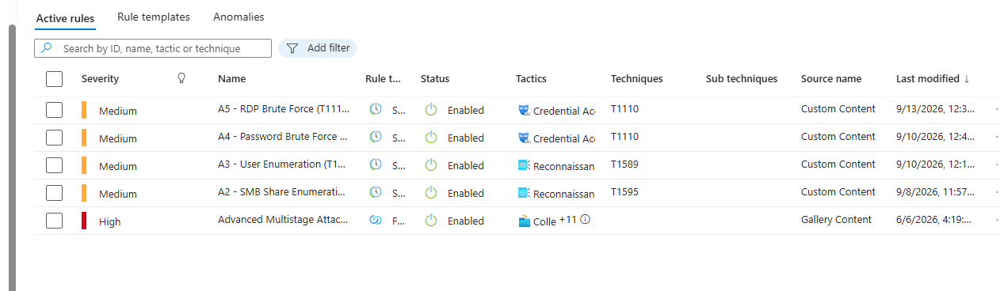

---

## Lab context

| VM | Role | IP |
|---|---|---|
| pfSense | Firewall / gateway | `192.168.10.1` |
| WinServer-DC (`WIN-1C8FND59J1C`) | Domain Controller, `jahnylabs.local` | `192.168.10.100` |
| DESKTOP-5EPJUT2 | Windows 10 victim (domain-joined) | `192.168.10.101` |
| Kali | Attacker | `192.168.10.102` |

Attack tooling: `netexec` (`nxc smb`, `nxc rdp`), `nmap`, `hydra`. All attacks sourced from Kali `.102` against the victim `.101`.

---

## Preparation (GOVERN / IDENTIFY / PROTECT — written once)

### Deliberate lab-state changes to make the attacks land

The default Windows posture blocked most of this scenario before it started. That is itself a finding (see **Hardening findings** below), but the attacks have to reach the victim to be detected, so the victim was deliberately weakened:

| Change | Setting | Why |
|---|---|---|
| RDP enabled | `fDenyTSConnections = 0` | A5 target |
| Firewall groups enabled | `Remote Desktop`, `File and Printer Sharing` | 3389 and 445 were both `filtered` until these were on |
| NLA disabled | `RDP-Tcp UserAuthentication = 0` | Lets `nxc rdp` reach the logon stage; re-enabling it is the A5 RECOVER action |
| Object-access auditing | `auditpol` **File Share** + **Detailed File Share** = Success and Failure | Was *No Auditing*; A2 has zero telemetry without it |

> Object-access auditing lives in the victim's local LSA policy, so a **snapshot revert wipes it** — it must be re-applied after any revert to the pre-A2 baseline.

### Telemetry routing (the fix the whole scenario depends on)

Early A2–A4 rules returned nothing while the pipeline looked healthy. Root cause: a `Security!*` XPath under a generic `windowsEventLogs` data source routes Windows Security events to the **`Event`** table, not **`SecurityEvent`** — so every rule written against `SecurityEvent` was querying an empty set. This is documented in full in [`../screenshots/scenario-a/`](../screenshots/scenario-a/) (frames 17–21) and summarised under A5.

**Fix:** added the supported *Windows Security Events via AMA* connector (its own managed DCR → `SecurityEvent`, for both victim and DC), and demoted the custom `windows10-security-events` DCR to Sysmon / TerminalServices / AppLocker only.

### Hardening findings (PROTECT evidence, banked during emulation)

- **SMB signing not enforced** on the victim (`signing:False` in the `nxc` banner) — a relay-exposure gap.
- **Default Windows Firewall blocks recon** — RDP 3389 and SMB 445 were both `filtered` until their firewall groups were explicitly enabled. `nmap`'s `filtered` (silent drop = firewall) vs `closed` (RST = service off) distinction is what separated "firewalled but enabled" from "actually disabled" and saved chasing the wrong fix.
- **NLA disabled is itself the exposure** for A5 — re-enabling it is the mitigation.

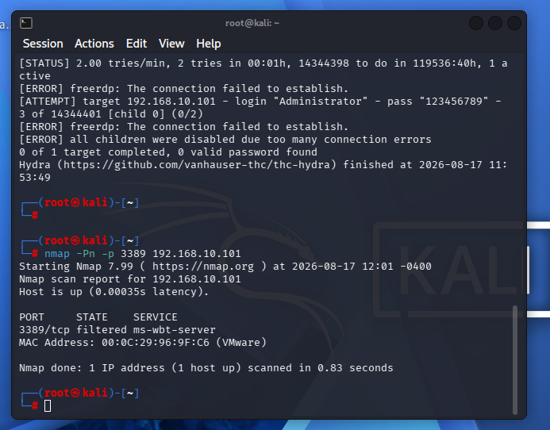

---

## A2 — SMB Share Enumeration (T1135)

### Attack

Authenticated share enumeration from Kali:

```
nxc smb 192.168.10.101 -u Administrator -p '<lab-pass>' --shares
```

The session authenticated (`Pwn3d!` as Administrator) and listed the shares, including the real admin shares `C$` and `ADMIN$` — richer telemetry than an anonymous enum, which only ever sees `IPC$`.

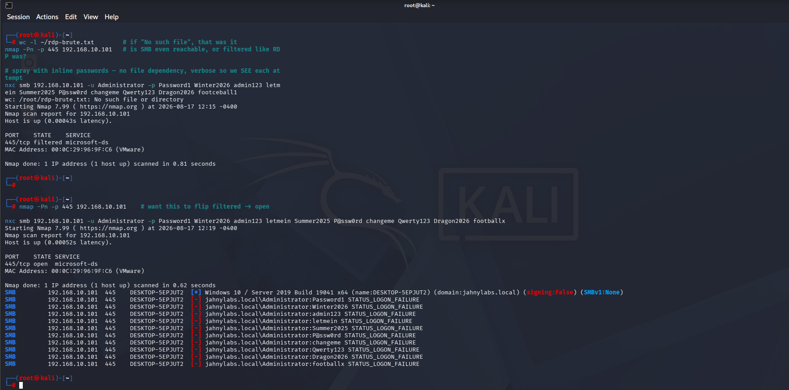

### DETECT (DE.CM-01, DE.AE-02)

Authenticated share access generates **5140** (a network share was accessed) and **5145** (a share object was checked for access). The `5145 RelativeTargetName` field is the strongest signal here: it captured `nxc`'s random probe filenames and its `srvsvc` / `svcctl` named-pipe binds — specific, tool-driven IOCs rather than generic file access.

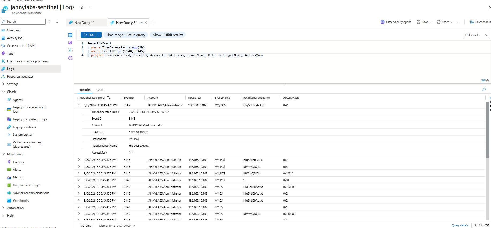

The rule keys burst logic on source IP: many distinct shares with varied access masks in a tight window. Validated result — one attacker IP, `ShareCount` covering the admin shares, `SampleFiles` showing the pipe binds:

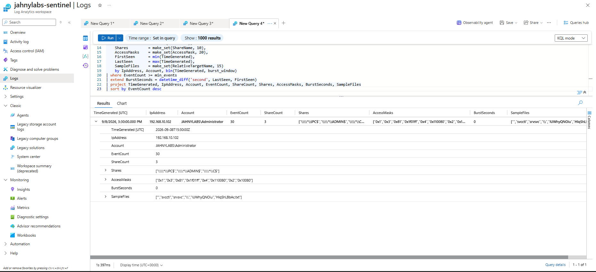

Rule: [`../detections/sentinel-kql/scenario-a-a2-smb-share-enum.kql`](../detections/sentinel-kql/scenario-a-a2-smb-share-enum.kql)

**Key infrastructure fact:** the `windows10-security-events` DCR `xPathQueries` is `Security!*` (unfiltered — all Security events, no EventID restriction) plus the AppLocker and Sysmon channels. Any new Security EventID reaches the pipeline with **no DCR surgery** — which is why 5140/5145 were available the moment auditing was enabled.

### RESPOND (RS.AN-03)

Confirm the source is not a legitimate admin tool or backup agent; scope which shares were touched from the `Shares` set; pivot on the source IP to see whether the same host also produced 4625 brute-force activity (Sentinel auto-correlates this — see A4).

### RECOVER / IMPROVEMENT (ID.IM-03)

Restrict admin-share exposure; keep object-access auditing on as a standing control (it is the prerequisite this whole example depends on). Mapping note for reviewers: the roadmap files A2 under T1595 to match the recon theme, but internal authenticated share enumeration maps more cleanly to **T1135 (Network Share Discovery)** — used here.

---

## A3 vs A4 — The `SubStatus` Discriminator

A3 and A4 are the heart of the scenario. Both produce **4625, LogonType 3**, through the same pipeline. The shape is inverted, and the discriminator is a single field — `SubStatus`:

| | A3 — User enumeration (T1589.002) | A4 — Password brute force (T1110.001) |
|---|---|---|
| Pattern | Many accounts, one password | One account, many passwords |
| Dominant `SubStatus` | `0xC0000064` — account does not exist | `0xC000006A` — valid user, wrong password |
| What it tells the analyst | Attacker is *building* a target list | Attacker *has* a target and is guessing |
| Rule output | Names the valid accounts discovered | Failure count + source IP per account |

Reading `SubStatus` is the difference between "someone fat-fingered a password" and "someone just confirmed three of your accounts exist." The raw 4625 shows it plainly — failure reason and `Sub Status: 0xC000006A`:

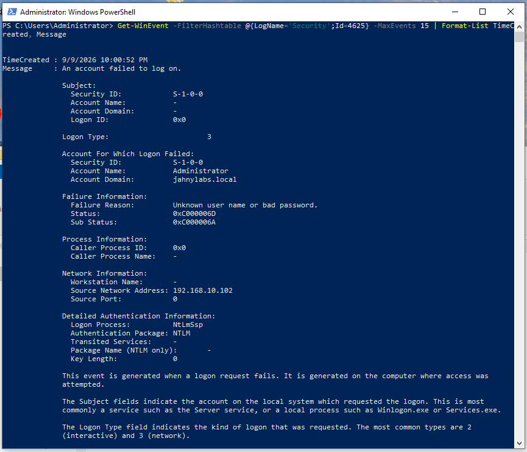

### A3 — User Enumeration (T1589.002)

**Attack.** A mixed list of real and fake usernames sprayed with one password from `.102`. Fake users return `0xC0000064` (STATUS_NO_SUCH_USER); real users return `0xC000006A`.

**DETECT.** The rule counts distinct users per source, separates not-found from wrong-password by `SubStatus`, and — the useful part — **names the valid accounts it found**. Validated run auto-named the three real accounts (`Administrator`, `Guest`, `svc-sql-lab`) and flagged "enumeration + valid account(s) discovered":

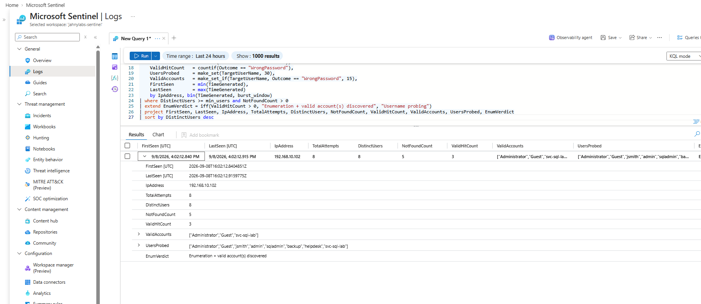

Rule: [`../detections/sentinel-kql/scenario-a-a3-user-enum.kql`](../detections/sentinel-kql/scenario-a-a3-user-enum.kql)

**RESPOND / RECOVER.** Treat any named valid account as a confirmed target for follow-on brute force; watch those accounts specifically. User enumeration fits **T1589.002** more cleanly than T1110 and is mapped that way.

### A4 — SMB Brute Force (T1110.001)

**Attack.** Ten passwords sprayed at `Administrator` over SMB with `nxc` — one account, many passwords.

**DETECT.** 10× 4625 LogonType 3, all `STATUS_LOGON_FAILURE`, all `SubStatus 0xC000006A`. First validated Sentinel hit — `jahnylabs.local\Administrator`, IP `192.168.10.102`, `FailedCount 10`:

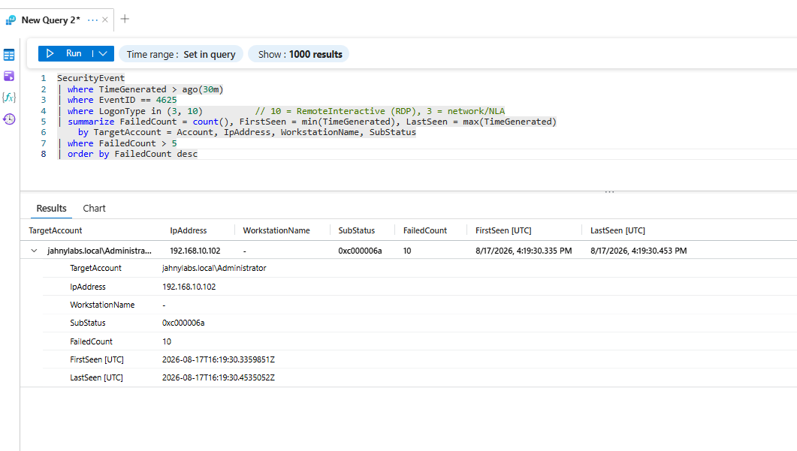

**Noise lesson.** `nxc`'s initial null/anonymous SMB session lands as a separate benign 4625 (`TargetAccount "\"`, `SubStatus 0x0`). Filtering `Account !endswith "\\"` drops it cleanly:

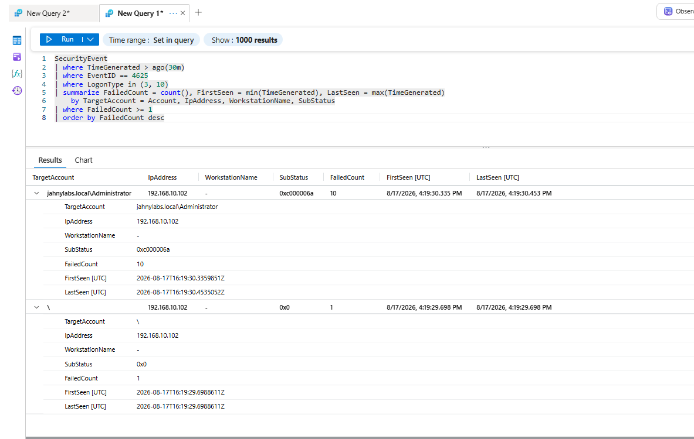

Rule: [`../detections/sentinel-kql/scenario-a-a4-smb-brute-force.kql`](../detections/sentinel-kql/scenario-a-a4-smb-brute-force.kql)

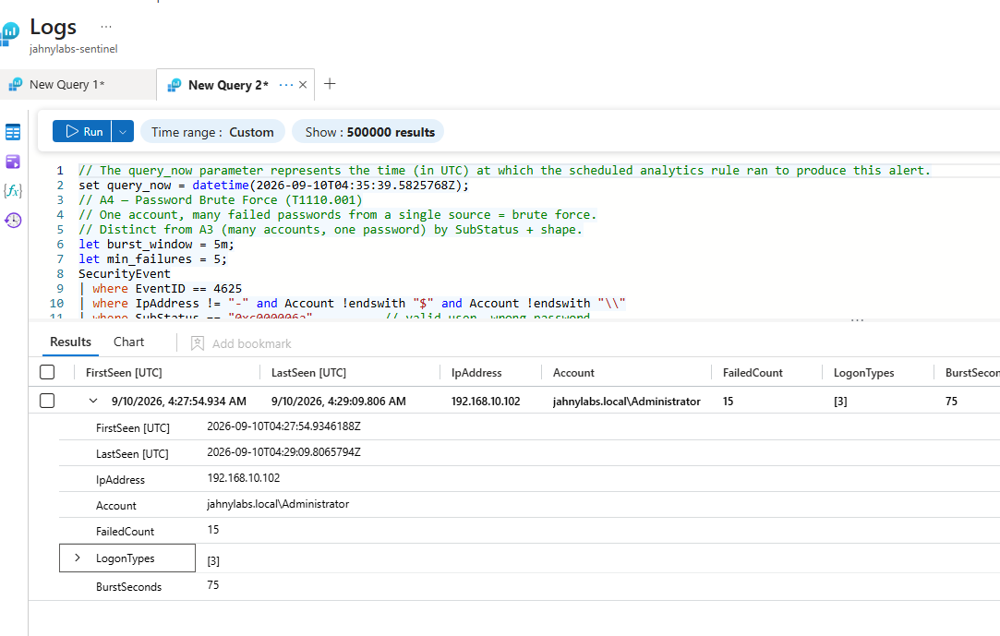

**Deployed + incident.** The rule runs as a scheduled analytics rule and raises a Sentinel incident with the attacker IP and account as mapped entities:

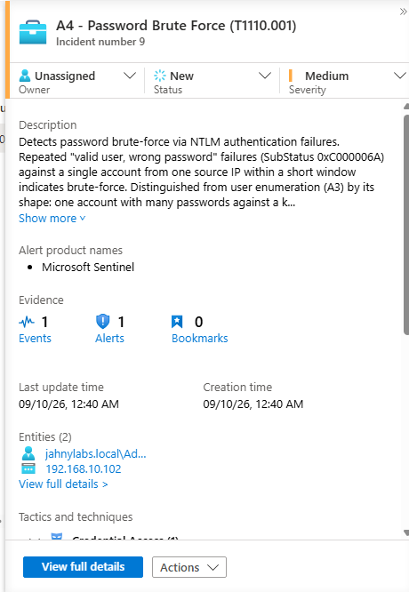

**RESPOND / RECOVER.** Lock/disable the targeted account or force a reset; block the source IP; confirm no successful 4624 followed the burst. Re-enabling NLA and enforcing lockout thresholds are the standing mitigations.

**Detection lesson.** 4625 (and 4688) arrive in `SecurityEvent` as **native parsed columns** (`Account`, `IpAddress`, `LogonType`, `SubStatus`) — no `extract()` / XML parsing, unlike the 4769 Kerberoast rule in Scenario C. Knowing which events arrive pre-parsed and which do not is half of writing KQL that works the first time.

---

## A5 — RDP Brute Force (T1110.001): The Cross-Table Correlation

The expected answer is "RDP failures are LogonType 10." They are not. RDP brute-force failures land as **4625 LogonType 3**, and with NLA disabled they are *indistinguishable from SMB brute force* at the 4625 layer — same NtLmSsp / NTLM / `0xC000006A`.

**Attack.** Password list sprayed at `Administrator` over RDP with `nxc rdp` (`nla:False`), producing the same 4625 shape as A4.

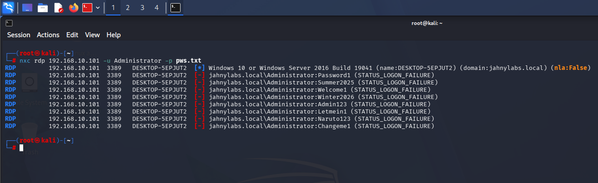

### DETECT — the discriminator lives on a different channel

The RDP tell is **Event 261** ("Listener RDP-Tcp received a connection") on the `TerminalServices-RemoteConnectionManager/Operational` channel, which lands in the **`Event`** table. So the A5 rule is a genuine **cross-table correlation** — `SecurityEvent` 4625 joined against `Event` 261 by host and time bin — rather than a single-table threshold like A2–A4:

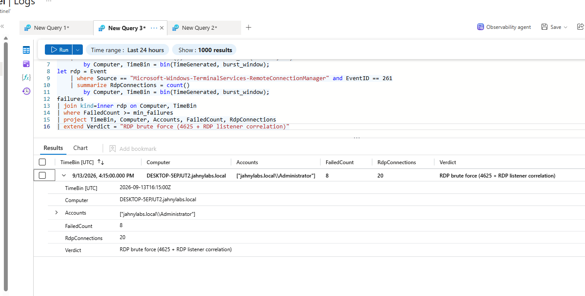

Rule: [`../detections/sentinel-kql/scenario-a-a5-rdp-brute-force.kql`](../detections/sentinel-kql/scenario-a-a5-rdp-brute-force.kql)

This required adding the `TerminalServices-RemoteConnectionManager/Operational` channel to the custom DCR — it is not collected by default:

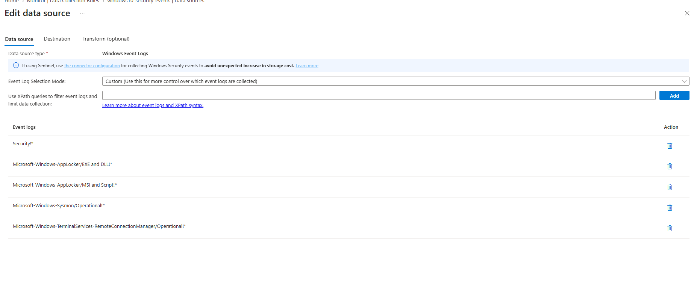

Event 261 landing after the change:

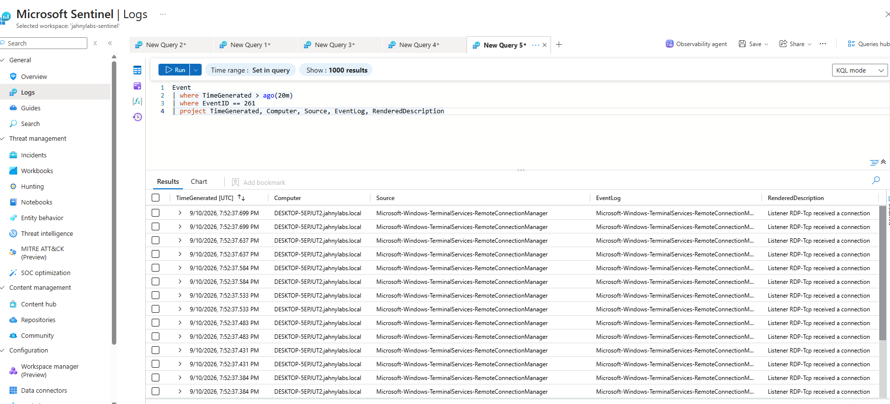

### The infrastructure fix inside A5 (the real work)

Building A5 surfaced two pipeline faults that had been silently blinding A2–A4:

1. **AMA was never actually running on the victim.** The `AzureMonitorAgent` extension *resource* had existed since the A2 work, but the guest install never completed — most likely a snapshot revert landing on a pre-AMA state while the Azure-side resource persisted. On **Arc** machines, AMA proof-of-life is the `MonAgentCore` process, **not** a `Get-Service AzureMonitorAgent` service — checking the wrong name gives a convincing false negative on a healthy install. Repaired with `az connectedmachine extension create`.

   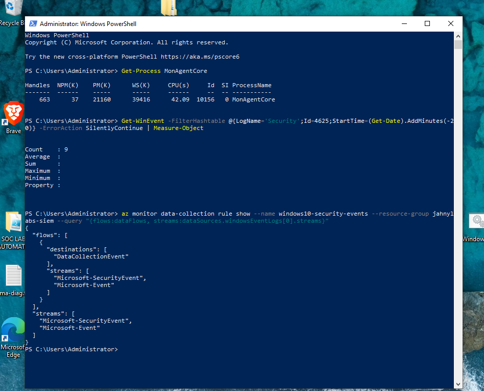

2. **DCR table-routing fault.** `Security!*` under a generic `windowsEventLogs` XPath routed Security events into the `Event` table, not `SecurityEvent`. The tell: `SecurityEvent | where EventID == 4625` returned empty while `Event | where EventID == 4625` had the rows.

   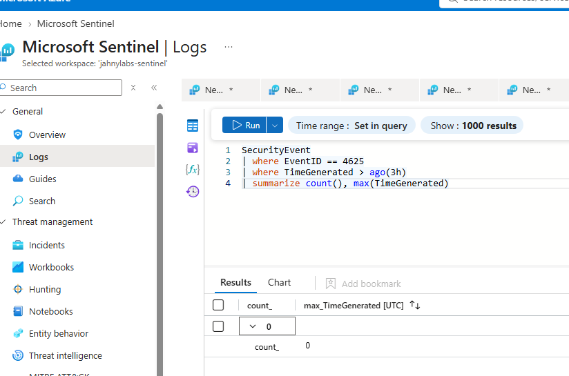
   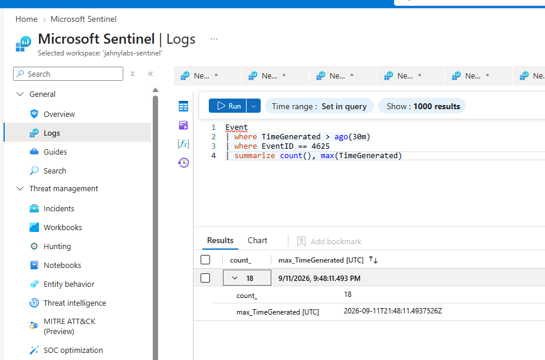

   Fixed by adding the supported *Windows Security Events via AMA* connector (own managed DCR → `SecurityEvent` for victim + DC):

   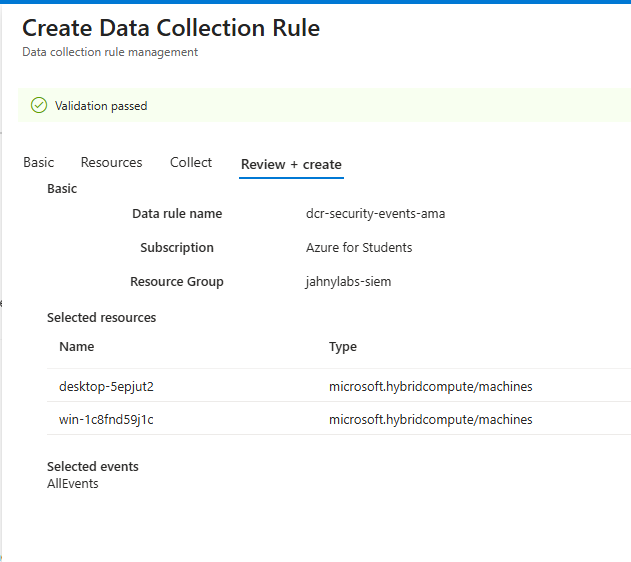
   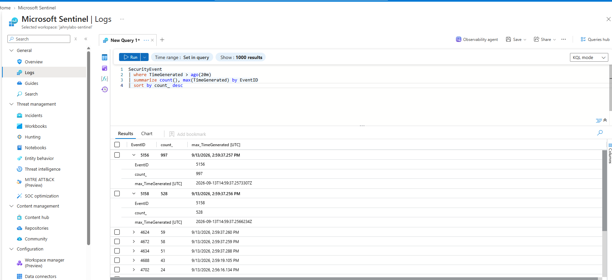

**Lesson:** "is the data flowing?" and "is the data where my rule is looking?" are two different questions. **Durable runbook fix:** snapshot the victim *while AMA is healthy* and make that the baseline, so reverts stop re-breaking the agent.

### RESPOND / RECOVER

Re-enable NLA (removes the LogonType-3 ambiguity and forces pre-auth), enforce account lockout, block the source IP, and confirm no 4624 success followed the burst.

### Bonus finding — incident correlation

With all four rules deployed, Sentinel's investigation graph **auto-correlated** the A4 brute force and the A2 share enumeration through the shared attacker IP — the incident-correlation behaviour a Tier 1 analyst actually works with, demonstrated on my own rules:

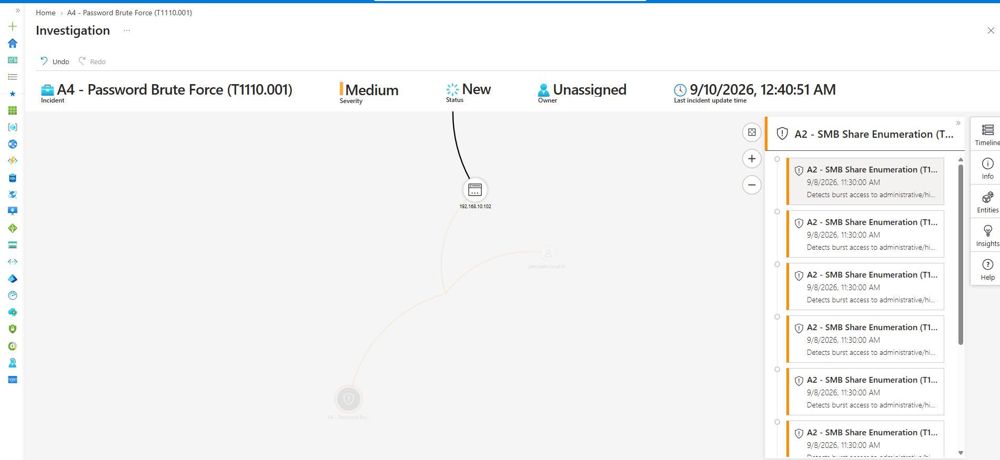

---

## A1 — Port Scan (T1595.001): in progress

A port scan generates no authentication, so there is no 4625 to lean on. The telemetry is either **WFP 5156/5157** in `SecurityEvent` (requires Filtering Platform Connection auditing enabled) or the **pfSense firewall log** (reliable, but not currently forwarded to Sentinel — no syslog forwarder). This is the remaining Scenario A example.

---

## Cross-pillar note

The same 4625 evidence is visible in the Elastic pillar via `event.code: "4625" and winlog.event_data.SubStatus: "0xc000006a"` — the OCI-hosted Elastic stack has ingested this telemetry continuously alongside Sentinel:

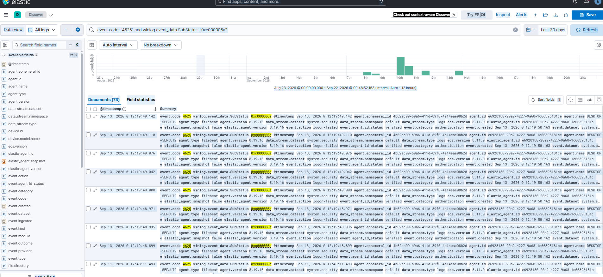

---

## MITRE ATT&CK mapping

| Technique | ID | Tactic | Detected by |
|---|---|---|---|
| Network Share Discovery | T1135 | Discovery | A2 — 5140/5145 burst rule |
| Gather Victim Identity Information | T1589.002 | Reconnaissance | A3 — 4625 `SubStatus` enumeration rule |
| Brute Force: Password Guessing (SMB) | T1110.001 | Credential Access | A4 — 4625 `0xC000006A` threshold rule |
| Brute Force: Password Guessing (RDP) | T1110.001 | Credential Access | A5 — 4625 × Event 261 correlation rule |
| Active Scanning: Scanning IP Blocks | T1595.001 | Reconnaissance | A1 — *in progress* |

---

## Validation evidence

Cropped, secret-safe screenshots in [`../screenshots/scenario-a/`](../screenshots/scenario-a/). Lab passwords, tenant IDs, and the signed-in account have been kept out of frame or cropped. Machine, workspace, and resource-group names are lab-internal and left visible for readability.
